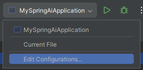
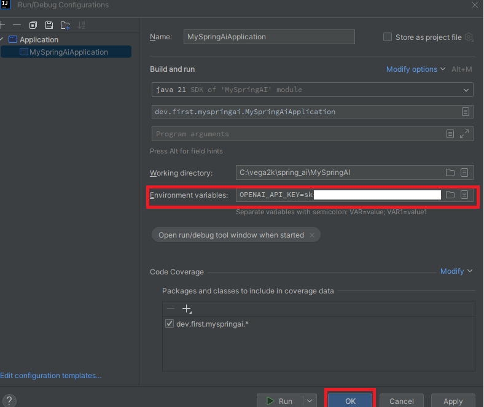

### Environment Variable ( 환경 변수 ) 설정하기
* **openapi 를 깃헙에 절대 노출금지**
```
spring.ai.openai.api-key=${OPENAI_API_KEY}
spring.ai.openai.chat.options.model=gpt-4
#spring.ai.openai.chat.options.model=gpt-4o
```




### Controller 호출하기
* ?message=Spring AI는 무엇입니까?
```
    GET   http://localhost:8080/api/chat
```

* ?message=python 이란?
```
    GET   http://localhost:8080/api/chat?message=python 이란?
```

* ?topic=javascript
```
    GET   http://localhost:8080/api/chatmap?topic=javascript
```

* ?topic=퍼블릭클라우드
```
    GET   http://localhost:8080/api/chat-with-prompt?subject=퍼블릭클라우드
```

